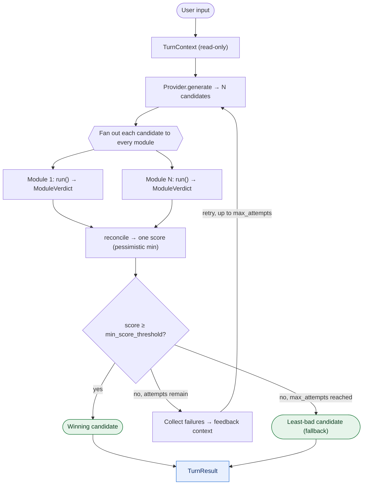

# `framework.py` — The Orchestrator

`AgenticFramework` runs the reflective loop: it asks the
model for candidate replies, then evaluates the candidates using reflective reasoning-based modules. Candidates that succeed in meeting user expectations/guidelines are considered a pass, while candidates that fail trigger a regeneration attempt. Candidates can be regenerated up to a set number of maximum attempts before the least bad option is selected.

This class isn't designed to be used directly, but rather to be used with the [`Reflective`](pipeline.md) pipeline, which wraps `AgenticFramework`. Only reach for the framework itself if you want the loop without the pipeline's logging, saving and convenience features.

## Overview

One turn runs as a loop with a limited number of attempts:

1. **Generate** several candidate replies from the provider.
2. **Judge** each candidate by handing it to every module. Each module returns a
   verdict.
3. **Reconcile** the verdicts into one score for the candidate (by default, the
   worst module score wins — one objection is enough to fail it).
4. **Keep or retry.** If a candidate's score reaches the threshold, it wins and
   the loop stops. If not, the modules' failures become feedback that is added
   to the next attempt's prompt.
5. **Fall back.** If no attempt produces a good-enough candidate, pick the
   least-bad one seen.



*One turn of the loop: the retry edge (`feedback → generate`) is what makes this
reflective rather than one-shot. Modules 1..N are whatever you pass in — this
package ships `EECModule` and `SelfSimulationModule`.*

## Dataclasses used

The framework defines three dataclasses; their full field lists are on the
[Dataclasses](dataclasses.md) page (each is built from its fields):

- [`FrameworkConfig`](dataclasses.md#frameworkconfig) — the loop's settings
  (`max_attempts`, `min_score_threshold`, `debug_mode`).
- [`ResponseCandidate`](dataclasses.md#responsecandidate) — one generated reply
  and everything learned about it.
- [`TurnResult`](dataclasses.md#turnresult) — the summary of one whole turn (this
  is what the pipeline returns and what gets saved). It has two methods,
  `winning_candidate()` and `to_dict()`, are documented on that page.

## Usage

```python
from reflective.framework import AgenticFramework, FrameworkConfig

framework = AgenticFramework(
    provider=my_provider,
    modules=[my_module],
    base_context="You are a helpful assistant.",
    framework_config=FrameworkConfig(max_attempts=3, min_score_threshold=0.7),
)

result = framework.main_chat_handler(
    user_input="Are you free Saturday?",
    conversation_history=[{"role": "user", "content": "Are you free Saturday?"}],
)
print(result.final_response, result.success, result.winning_score)
```

### `class AgenticFramework`

#### **Constructor**

```python
AgenticFramework(provider, modules, base_context, framework_config=None, slots=None)
```

Stores everything the loop needs and reads the config values once into plain
attributes (`max_attempts`, `min_score_threshold`, `debug_mode`). It warns (but
does not stop) if you pass no modules or an empty `base_context`, and it raises
`ValueError` if you pass a slot name it doesn't recognize.

| Parameter          | Type                                            | Default | What it does                                                              |
| ------------------ | ----------------------------------------------- | ------- | ------------------------------------------------------------------------- |
| `provider`         | `Provider`                                       | —       | The model host used to generate and to judge.                             |
| `modules`          | `List[ReflectiveModule]`                         | —       | The modules run over every candidate.                                     |
| `base_context`     | `str`                                            | —       | The scenario text, shared with modules and the generation prompt.         |
| `framework_config` | `Optional[FrameworkConfig]`                      | `None`  | The loop settings. Defaults are used if `None`.                           |
| `slots`            | `Optional[Dict[str, None \| str \| Callable]]`   | `None`  | Overrides for the generation-prompt slots (see [The slot system](#the-slot-system)). Unknown names raise `ValueError`. |

#### **Methods**

**`main_chat_handler(user_input, conversation_history) -> TurnResult`**

Runs the whole loop for one turn and returns a `TurnResult`. It builds a
read-only `TurnContext`, then repeats generate → judge → reconcile up to
`max_attempts` times, collecting feedback after each failed attempt. If a
candidate passes, it wins, and the loop stops early; if none pass, it falls back
to the least-bad candidate (or a plain apology if nothing was generated at all).

- `user_input` — the user's message for this turn.
- `conversation_history` — the chat history (a list of role/content dictionaries).
  The framework reads it but never changes it.
- **Returns** a `TurnResult` with the final reply and a full record of what
  happened.

**`reconcile(verdicts) -> float`**

Combines the per-module verdicts into one score for the candidate. It takes the candidate verdicts as an argument and returns the minimum module score among all of the verdicts. This is done to ensure that if any single module scores the candidate as a fail, the candidate's overall score reflects that. Its score becomes the lowest among all module scores, ensuring that regeneration occurs for any single failure. With no verdicts, it returns `1.0`. This is the intended place to add more in-depth logic later (like flagging disagreements
between modules).

- `verdicts` — a dictionary of `{module_name: ModuleVerdict}`.
- **Returns** the candidate's combined score.

**`generate_candidates(ctx, feedback_context=None, attempt=1) -> list[ResponseCandidate]`**

Builds the generation prompt and turns the model's output into candidates. The
prompt is assembled from the context, the recent history, any accumulated
feedback, guidance for the current attempt, the modules' own generation
instructions, and a footer. After the model replies, each module gets a chance to
parse its own artifact out of the raw text; each usable reply becomes a
`ResponseCandidate`.

- `ctx` — the turn's `TurnContext`.
- `feedback_context` — the failures gathered from earlier attempts (empty on the
  first attempt).
- `attempt` — which attempt this is (1, 2, 3, …), used to add escalating guidance.
- **Returns** a list of `ResponseCandidate` objects.

**`build_slot(slot, *args)`**

Resolves the generation-prompt slot's content for this call. If the slot's value
is plain text, it's used as-is; if it's a function, it's called with whatever
runtime information that slot needs. 

- `slot` — the slot name (e.g. `"feedback"`).
- `*args` — the runtime values that slot's function expects.
- **Returns** the slot's text.

#### **Internal Methods** (not part of the public interface, described for contributors)

**`_select_least_bad(candidates) -> ResponseCandidate`**

The fallback chooser. Sorts the candidates by score (highest first, with ties
broken by earlier attempt and lower sequence id) and returns the best one. Used
only when no candidate reached the threshold.

**`_feedback_key(record) -> tuple` *(static)***

Returns a simple identity for a feedback record: the pair `(module, rule)`. Two
records with the same key are "the same complaint" and shouldn't be duplicated.

**`_update_feedback_context(existing, new) -> None`**

Merges new failures into the running feedback list. For each new failure, if a
matching one (same `_feedback_key`) is already there, it replaces it; otherwise
it appends. This keeps the feedback current without piling up duplicates.

**`_trace_entry(candidate) -> dict` *(static)***

Builds a structured snapshot of one candidate's evaluation — the attempt, the
reply, the score, every module's verdict, and the decision — for the reasoning
trace saved with the result.

**`_print_debug(candidate) -> None`**

Prints a detailed breakdown of a candidate (its score and each module's verdict)
when `debug_mode` is on. Does nothing when it's off.

### The slot system

The generation prompt is put together from named **slots**. You can override any
of them through the `slots` argument to the constructor. A slot's value is either
a piece of text (used as-is), a function (called with the runtime state it
needs), or `None`.

```python
###################### Default Slots ######################
def default_feedback_slot(feedback_context: List[Dict]) -> str:
    if not feedback_context:
        return ""
    section = "\n\nIMPORTANT - DON'T VIOLATE THESE GUIDELINES:\n"
    for i, f in enumerate(feedback_context):
        # "Flagged by" identifies which module flagged the failure.
        section += (
            f"\nNumber {i+1}:\n"
            f"- Guideline: {f['rule']}\n"
            f"- Flagged by: {f.get('module', 'unknown')}\n"
            f"- How to Avoid: {f.get('fix_hint') or f['context']}\n"
            f"- Previous Sequence ID: {f.get('sequence_id', 'N/A')}\n"
        )
    section += "\nMake sure ALL your response variations avoid these issues!\n"
    return section


def default_attempt_guidance_slot(attempt: int) -> str:
    if attempt == 2:
        return (
            "\n\nATTEMPT 2 GUIDANCE:\n"
            "- Try different approaches that follow the guidelines\n"
            "- Consider how conversations might evolve differently\n"
            "- Generate diverse response styles while respecting guidelines\n"
        )
    if attempt >= 3:
        return (
            f"\n\nATTEMPT {attempt} GUIDANCE:\n"
            "- This is your final attempt, be very careful about guidelines\n"
            "- Consider conservative strategies\n"
            "- Prioritize guideline compliance over creativity\n"
        )
    return ""


DEFAULT_INSTRUCTIONS = (
    "Generate a response to the user's question.\n\n"
    "Your response should be natural and helpful while considering "
    "the context and any guidance provided above."
)

DEFAULT_FOOTER = "IMPORTANT: Generate diverse, varied responses while following all guidelines."

DEFAULT_SLOTS: Dict[str, Union[None, str, Callable]] = {
    "feedback": default_feedback_slot,              # callable(feedback_context) -> str
    "attempt_guidance": default_attempt_guidance_slot,  # callable(attempt) -> str
    "instructions": None,   # None -> module build_generation_prompt()s, else DEFAULT_INSTRUCTIONS
    "footer": DEFAULT_FOOTER,
}
```

`DEFAULT_SLOTS` is the dictionary that ties the four slot names to their default values.

| Slot               | Default                         | Argument                        | Description                                                      |
| ------------------ | ------------------------------- | ------------------------------- | ---------------------------------------------------------------- |
| `feedback`         | `default_feedback_slot`         | the feedback list               | A section built from the accumulated list of any failed expectations/guidelines after an evaluation attempt. When non-empty, the feedback method returns a string telling the LLM not to violate any of the listed guidelines, along with the module that flagged the failure, feedback on how to avoid the mistake, and the corresponding sequence ID. It remains empty on the first attempt, but steers the feedback for future attempts.|
| `attempt_guidance` | `default_attempt_guidance_slot` | the attempt number              | Takes in the attempt number as an argument and returns escalating guidance text, guiding the LLM on how to better approach its candidate generation to avoid any guideline failures. Does not apply to the first attempt.                            |
| `instructions`     | `None`                          | —                               | If set, replaces the modules' generation instructions. If `None`, each module contributes its own; if no modules provide generation instructions, `DEFAULT_INSTRUCTIONS` is used. |
| `footer`           | `DEFAULT_FOOTER`                | —                               | A closing line added to every generation prompt for any additional instructions.            |


## Notes

- **Modules are independent.** They're run as `{m.name: m.run(...) for m in modules}`
  — each on its own, none reading another's output — which is what makes the
  fan-out safe to run in parallel for future work. Currently it runs one after another.
- **Artifacts.** If a module's verdict carries an artifact, the framework stores
  it on the candidate under `annotations[module.name]`.
- **Quiet by default.** Importing the package attaches a do-nothing log handler,
  so nothing prints unless the pipeline's capture or your own application turns logging
  on.
